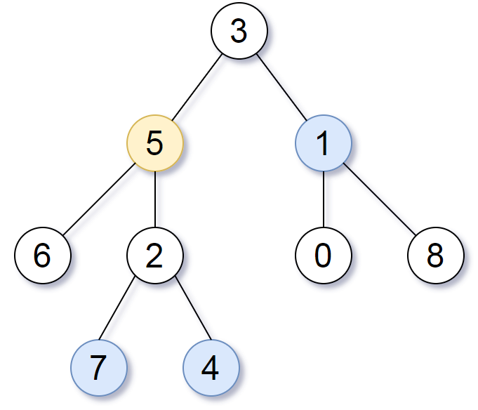

# BFS+邻接表

## 1. All Nodes Distance K in Binary Tree

We are given a binary tree \(with root node `root`\), a `target` node, and an integer value `K`.

Return a list of the values of all nodes that have a distance `K` from the `target` node.  The answer can be returned in any order.


**Example 1:**

\*\*\*\*

```text
Input: root = [3,5,1,6,2,0,8,null,null,7,4], target = 5, K = 2
Output: [7,4,1]

Explanation: 
The nodes that are a distance 2 from the target node (with value 5)
have values 7, 4, and 1.
Note that the inputs "root" and "target" are actually TreeNodes.
The descriptions of the inputs above are just serializations of these objects.
```



一二叉树，给一个根结点，和一个目标结点以及一个距离K，要求所以和目标结点相距为K的结点值。根据例子，目标结点5，于其相距为2的结点分别是：7，4，1：也就是连接距离为2。

**思路：直接根据二叉树来找结果，在这里有些不好思考，如果把目标结点看作根结点呢？就会发现\[2,3,6\]是第一层，\[1,7,4\]刚好是第二层，也就是K。然后这就是一个图的BFS过程，遍历到第K层就可以了**

**关键再与，如何构建这个图，因为我们知道二叉树只有left，right两个point，而图是有多个孩子的。从这里我们可以构建邻接表，因为我们知道各自结点的孩子结点以及父结点**

**根据这个图我们可以构建出邻接表:**  
  


上图的邻接表就是这样的，那么剩下的就是 通过 队列+visit数组来寻找结点的过程了。队列先push目标结点，之后相应visit设置为true，当访问到K层时，把结果找出来。我们在此可以用一个map存储邻接表，key为结点，value为其邻居结点。在构建邻接表时，我们可以用二叉树的几种遍历方法实现构建这个表，这里使用先序遍历。

```cpp
class Solution {
public:

	void build_table(TreeNode *node, TreeNode *parent, unordered_map<TreeNode*,vector<TreeNode*>> &table){
		if(!node) return;
		if(table.count(node)) return;
		if(parent){
			table[node].push_back(parent);
			table[parent].push_back(node);
		}
		build_table(node->left,node,table);
		build_table(node->right,node,table);
	}

    vector<int> distanceK(TreeNode* root, TreeNode* target, int K) {
		unordered_map<TreeNode*,vector<TreeNode*>> table;
		vector<int> res;
		int level = 1;
		build_table(root,NULL,table);
		unordered_set<TreeNode*> visited{{target}};
		queue<TreeNode*> my_queue;
		unordered_map<TreeNode*,bool> visited;
		TreeNode* tmp_node;

		if(!root)
			return res;

		my_queue.push(target);
		my_queue.push(NULL);

		while(!my_queue.empty()){	
			while(my_queue.front()!=NULL){	
				tmp_node = my_queue.front();
				visited[tmp_node] = true;

				if(level==K){
					for(auto item:table[tmp_node]){
						if(!visited[item])
							res.push_back(item->val);
					}
				}
				for(auto item:table[tmp_node]){
					if(visited[item])
						continue;
					my_queue.push(item);	
				}
				my_queue.pop();
			}
			my_queue.pop();
			level++;
			if(!my_queue.empty())
				my_queue.push(NULL);
			if(level>K)
				return res;
		}
		
		return res;
    }
};
```
```

  


  


\*\*\*\*

\*\*\*\*

