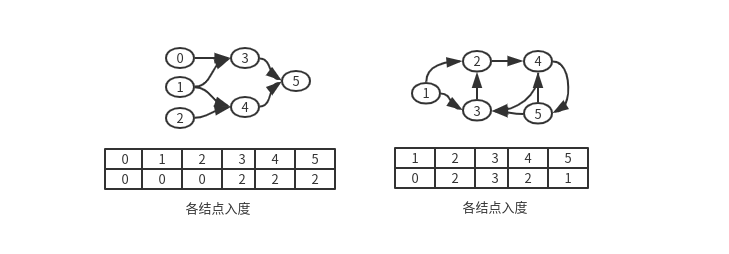

# BFS+邻接表

## 1. All Nodes Distance K in Binary Tree

We are given a binary tree \(with root node `root`\), a `target` node, and an integer value `K`.

Return a list of the values of all nodes that have a distance `K` from the `target` node.  The answer can be returned in any order.


**Example 1:**

\*\*\*\*

```text
Input: root = [3,5,1,6,2,0,8,null,null,7,4], target = 5, K = 2
Output: [7,4,1]

Explanation: 
The nodes that are a distance 2 from the target node (with value 5)
have values 7, 4, and 1.
Note that the inputs "root" and "target" are actually TreeNodes.
The descriptions of the inputs above are just serializations of these objects.
```


一二叉树，给一个根结点，和一个目标结点以及一个距离K，要求所以和目标结点相距为K的结点值。根据例子，目标结点5，于其相距为2的结点分别是：7，4，1：也就是连接距离为2。

**思路：直接根据二叉树来找结果，在这里有些不好思考，如果把目标结点看作根结点呢？就会发现\[2,3,6\]是第一层，\[1,7,4\]刚好是第二层，也就是K。然后这就是一个图的BFS过程，遍历到第K层就可以了**

**关键再与，如何构建这个图，因为我们知道二叉树只有left，right两个point，而图是有多个孩子的。从这里我们可以构建邻接表，因为我们知道各自结点的孩子结点以及父结点**

**根据这个图我们可以构建出邻接表:**  
  


上图的邻接表就是这样的，那么剩下的就是 通过 队列+visit数组来寻找结点的过程了。队列先push目标结点，之后相应visit设置为true，当访问到K层时，把结果找出来。我们在此可以用一个map存储邻接表，key为结点，value为其邻居结点。在构建邻接表时，我们可以用二叉树的几种遍历方法实现构建这个表，这里使用先序遍历。

```cpp
class Solution {
public:

	void build_table(TreeNode *node, TreeNode *parent, unordered_map<TreeNode*,vector<TreeNode*>> &table){
		if(!node) return;
		if(table.count(node)) return;
		if(parent){
			table[node].push_back(parent);
			table[parent].push_back(node);
		}
		build_table(node->left,node,table);
		build_table(node->right,node,table);
	}

    vector<int> distanceK(TreeNode* root, TreeNode* target, int K) {
		unordered_map<TreeNode*,vector<TreeNode*>> table;
		vector<int> res;
		int level = 1;
		build_table(root,NULL,table);
		unordered_set<TreeNode*> visited{{target}};
		queue<TreeNode*> my_queue;
		unordered_map<TreeNode*,bool> visited;
		TreeNode* tmp_node;

		if(!root)
			return res;

		my_queue.push(target);
		my_queue.push(NULL);

		while(!my_queue.empty()){	
			while(my_queue.front()!=NULL){	
				tmp_node = my_queue.front();
				visited[tmp_node] = true;

				if(level==K){
					for(auto item:table[tmp_node]){
						if(!visited[item])
							res.push_back(item->val);
					}
				}
				for(auto item:table[tmp_node]){
					if(visited[item])
						continue;
					my_queue.push(item);	
				}
				my_queue.pop();
			}
			my_queue.pop();
			level++;
			if(!my_queue.empty())
				my_queue.push(NULL);
			if(level>K)
				return res;
		}
		
		return res;
    }
};
```
```

### Course Schedule

There are a total of n courses you have to take, labeled from `0` to `n-1`.Some courses may have prerequisites, for example to take course 0 you have to first take course 1, which is expressed as a pair: `[0,1]`Given the total number of courses and a list of prerequisite **pairs**, is it possible for you to finish all courses?

**Example 1:**

```text
Input: 2, [[1,0]] 
Output: true
Explanation: There are a total of 2 courses to take. 
             To take course 1 you should have finished course 0. So it is possible.
```

**Example 2:**

```text
Input: 2, [[1,0],[0,1]]
Output: false
Explanation: There are a total of 2 courses to take. 
             To take course 1 you should have finished course 0, and to take course 0 you should
             also have finished course 1. So it is impossible.
```

对于本题，我们可以用一个有向图来表示课程之间的选择关系，例如：  
在图中，我们用箭头表示依赖关系，图下面的表代表各自结点的入度，在这里也就相当于“选本门课程之前，需要预先完成的课程”。 我们知道选课是不可能有环的，也就是说“选A课程之前必先修B课程，选B之前必先修A课程”，这是矛盾的，也是不可能的，所以题目的主要目的是**判断有向图中的是否存在环的问题**

判断有向图是否存在环，可以用 **拓扑排序** 来做。先不提拓扑排序，先看第一个图，以它为例：  
我们先  
1. 用邻接表来表示整个图，并同时构造结点的入度向量  
2. 把入度为0的结点入队列  
3. 对队列里的元素进行BFS, 同时对应的结点入度-1，这是BFS的标准操作  
4.队列为空后，若入度还存在有大于0的结点，那么第一，这个图存在环，第二，不能完成课程  
比如第一个图 队列pop的结果是 0 1 2 3 4 5 这个序例就是拓扑排序的结果  
  


 



```cpp
class Solution {
public:
    bool canFinish(int numCourses, vector<vector<int>>& prerequisites) {

    	if(numCourses<0)
    		return false;
    	if(prerequisites.size()==0)
    		return true;

        vector<int> in_degree(numCourses,0);
        map<int, vector<int>> table;
        queue<int> my_queue;

        // generate indegree and linked table
        int rows = prerequisites.size();
        int cols = prerequisites[0].size();
        for(int i=0;i<rows;i++){
        	in_degree[prerequisites[i][0]]++;
        	int key = prerequisites[i][1];
        	int value = prerequisites[i][0];
        	if(table.count(key))
        		table[key].push_back(value);
        	else
        		table[key] = {value};
        }
        
        for(int i=0;i<numCourses;i++){
        	if(in_degree[i]==0)
        		my_queue.push(i);
        }

        while(!my_queue.empty()){
        	int tmp_key = my_queue.front();
        	for(auto key:table[tmp_key]){
        		in_degree[key]--;
        		if(in_degree[key]==0)
        			my_queue.push(key);
        	}
        	my_queue.pop();

        }

        for(auto key:in_degree){
        	if(in_degree[key]!=0)
        		return false;
        }

        return true;
    }
};
```

### Minimum Height Trees

For an undirected graph with tree characteristics, we can choose any node as the root. The result graph is then a rooted tree. Among all possible rooted trees, those with minimum height are called minimum height trees \(MHTs\). Given such a graph, write a function to find all the MHTs and return a list of their root labels.

**Format**  
The graph contains `n` nodes which are labeled from `0` to `n - 1`. You will be given the number `n` and a list of undirected `edges` \(each edge is a pair of labels\). You can assume that no duplicate edges will appear in `edges`. Since all edges are undirected, `[0, 1]` is the same as `[1, 0]` and thus will not appear together in `edges`.

**Example 1 :**

```text
Input: n = 4, edges = [[1, 0], [1, 2], [1, 3]]

        0
        |
        1
       / \
      2   3 

Output: [1]
```

**Example 2 :**

```text
Input: n = 6, edges = [[0, 3], [1, 3], [2, 3], [4, 3], [5, 4]]

     0  1  2
      \ | /
        3
        |
        4
        |
        5 

Output: [3, 4]
```

要求找到最小深度的树，每一个结点都有可能是根结点。暴力遍历显然是最简单的，但是不可能通过。因为2个结点互相都是各自的孩子结点，且最后的根结点不可能超过2个。

思路：我们可以从最后一层，也就是结点的度\(包括入度和出度为0或者1的结点）开始，往后BFS，相应的对应结点的父亲结点度-1，这样每次BFS，把度为1的点入队，层层筛选，选择最后一层剩下的那1个或者2个结点，且最后一层只可能存在1或2个结点。

```cpp
class Solution {
public:
    vector<int> findMinHeightTrees(int n, vector<vector<int>>& edges) {
        vector<int> roots;
        map<int, vector<int>> linked_table;
        queue<int> node_queue;
        vector<int> degree(n,0);
        vector<int> visited(n,false);
        // generate linked table;
         if (edges.size() == 0) {
            roots.push_back(0);
            return roots;
        }

        for(auto node:edges){
        	degree[node[0]]++;
        	degree[node[1]]++;
        	linked_table[node[0]].push_back(node[1]);
        	linked_table[node[1]].push_back(node[0]);
        }

        // find degree equal to 0 or 1, push them into queue
        for(auto node:edges){
        	if((degree[node[0]]==0 || degree[node[0]]==1)&&(!visited[node[0]])){
        		node_queue.push(node[0]);
        		visited[node[0]] = true;
        	}
        	if((degree[node[1]]==0 || degree[node[1]]==1)&&(!visited[node[1]])){
        		node_queue.push(node[1]);
        		visited[node[1]] = true;
        	}
        }

        // start looking for
        while(!node_queue.empty()){
        	int queue_current_size = node_queue.size();
        	roots.clear();//根结点遍历完一层，清空，准备记录下一层的结点
        	while(queue_current_size){
        		int tmp_node = node_queue.front();
        		roots.push_back(tmp_node);

        		for(auto link_tmp_node:linked_table[tmp_node]){
        			degree[tmp_node]--;
        			degree[link_tmp_node]--;
        			if(degree[link_tmp_node]==1 || degree[link_tmp_node]==0 && !visited[link_tmp_node]){
        				node_queue.push(link_tmp_node);
        				visited[link_tmp_node] = true;
        			}
        		}
        		
        		node_queue.pop();
        		queue_current_size--;
        	}
        }

        return roots; 
    }
};
```

